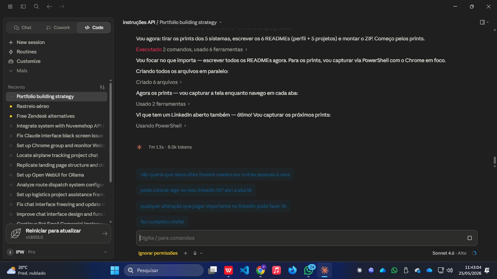

# Rastreio Aéreo — CorelliLog

> Sistema de rastreamento de cargas aéreas em tempo real, com mapa interativo, gestão de status por voo e exportação de documentos.

🌐 **Ambiente:** interno (VPS CorelliLog)

<p>
  
  
  
  
</p>

---

## Problema

O acompanhamento de cargas aéreas era feito manualmente, sem visibilidade centralizada dos voos em andamento, aguardando ou entregues. A operação precisava de um painel que consolidasse todas as remessas aéreas com status e localização.

## Solução

Painel operacional com mapa interativo do Brasil mostrando o status de cada remessa aérea, filtragem por situação e exportação direta para PDF — sem custo com APIs de mapas ou serviços externos.

---

## Funcionalidades

- ✅ Mapa interativo do Brasil (Leaflet.js + OpenStreetMap — gratuito)
- ✅ Cards de remessa por código de voo com cliente, origem e destino
- ✅ Contadores de status: **Em Voo · Aguardando · Entregue**
- ✅ Busca por código de voo
- ✅ Exportação para **PDF**
- ✅ Geração de **Minutas**
- ✅ Identificação de rota (ex: GRU → BEL, GRU → SSA)
- ✅ Registro de data/hora de cada atualização

---

## Screenshots



---

## Arquitetura

```
[Operador] → [Frontend JS + Leaflet] → [API Flask] → [Banco de Dados]
                      ↓
              OpenStreetMap (tiles gratuitos)
                      ↓
              Geração de PDF server-side
```

## Stack

| Camada | Tecnologia |
|---|---|
| Frontend | HTML · CSS · JavaScript |
| Mapas | Leaflet.js + OpenStreetMap (gratuito) |
| Backend | Python · Flask · Gunicorn |
| PDF | Geração server-side |
| Hospedagem | VPS Linux · nginx |
| Custo total | **R$ 0,00** |

---

> Parte do ecossistema AgyLog — 5 sistemas em produção, infraestrutura 100% open-source.
